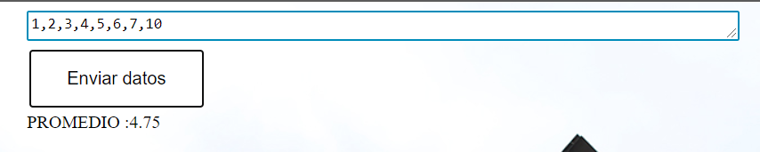

# Implementación de una arquitectura balanceada con Round Robin, por medio de contenedores ligeros

Este proyecto consiste en la implementación de una arquitectura de consulta y respuesta
balanceada de registros de códigos por medio de una página web.

[](https://www.codacy.com/manual/alejovasquero/AREP---DockerWeb?utm_source=github.com&amp;utm_medium=referral&amp;utm_content=alejovasquero/AREP---DockerWeb&amp;utm_campaign=Badge_Grade)
[](https://circleci.com/gh/alejovasquero/AREP---DockerWeb)
[DESPLIEGUE EN AWS](http://ec2-54-237-2-49.compute-1.amazonaws.com:8087/)
## Empezando

Estas instrucciones te utilizar la página web, compilar el proyecto y las pruebas.
Las instrucciones se limitan a compilación, ejecución y uso. Vamos a ver la manera de hacer que el software funcione
de manera local y por medio de Amazon Web Services.

### Prerrequisitos 

Para instalar y correr exitosamente este proyecto necesitamos:
* **Java**
* **Maven**
* **Git**
* **Docker**

### Instalación

Primeramente vamos a descargar el repositorio en nuestra máquina local, y en la carpeta de 
nuestra preferencia. En consola vamos a digitar el siguiente comando para clonar el repositorio.

```console
git clone https://github.com/alejovasquero/AREP---DockerWeb
```

Entremos a el directorio del proyecto

```console
cd AREP---DockerWeb
```

Debemos compilar el proyecto, que contiene las clases necesarias para poder correr nuestro
proyecto. Por medio de maven vamos a crear todos los compilables **.class**. Desde consola, y ubicados en la carpeta donde se encuentra
nuestra configuración de maven.

```console
mvn package
```

Ahora que nuestras clases etan compiladas vamos a ejecutar la clase principal para
ver el código en acción : )

--------------------

### Arquitectura local

Lo primero que vamos a hacer es crear dos servicios, el primero es una instancia de
un servicio web que estará de cara al usuario, y el otro es una base de datos en
mongodb, donde guardaremos los códigos.

```console
docker-compose up -d
```

Docker compose nos permite usar un conjunto de imágenes y configuraciones
en un mismo archivo general, que arrancará todos los servicios que se indiquen.

Ahora vamos a conectarnos a nuestra nueva base de datos con mongodb.

```console
mongo --host localhost --port 27017
```

El puerto está especificado en el archivo compose, por lo que es posible cambiarlo.
Vamos a crear las instancias de servicios de logging por medio de la creación de contenedores basados en imágenes.

```console
docker build --tag docker-arep:first .
```

Ahora vamos a crear 3 contenedores.

```console
docker run -dp 36000:6000 --name logging-first docker-arep:first
docker run -dp 36001:6000 --name logging-second docker-arep:first
docker run -dp 36002:6000 --name logging-third docker-arep:first
```

### Despliegue en AWS

Con el objetivo de usar dockerhub para la descarga de las imágenes, vamos a crear 1 imagen,
por lo que la descarga de otros archivos la vamos a dejar a git y maven.

Primero vamos a crear la imagen del servicio de log.

```console
docker build --tag arep-logger:latest .
docker tag arep-logger alejovasquero/arepdockerapp
docker push alejovasquero/arepdockerapp
```

Ahora vamos a descargar nuestro proyecto en AWS e iniciar las demás instancias.
En AWS - EC2:
```
git clone https://github.com/alejovasquero/AREP---DockerWeb
cd AREP---DockerWeb/
mvn package
```

Ahora vamos a configurar los contenedores.

Primero iniciamos el servidor web y la base de datos mongodb.

```
docker-compose up -d
```

Ahora vamos a iniciar las 3 instancias de logging.

```
docker run -dp 36000:6000 --name logging-first alejovasquero/arepdockerapp
docker run -dp 36001:6000 --name logging-second alejovasquero/arepdockerapp
docker run -dp 36002:6000 --name logging-third alejovasquero/arepdockerapp
```

Verificamos que todos los servicios estén corriendo.


Ahora abrimos el puerto del servidor web.


Ahora tenemos nuestra página web corriendo :stuck_out_tongue_winking_eye:



## Construido con

* [Maven](https://maven.apache.org/) - Manejo de dependencias
* [Git](https://git-scm.com/) - Control de versiones
* [Java](https://www.java.com/es/) - Lenguaje de programación
* [Spark](http://sparkjava.com/) - Framework de desarrollo web
* [Docker](https://www.docker.com/) - Contenedores ligeros
* [MongoDB](https://www.mongodb.com/es) - Administración y manejo de bas de datos

## Autores

* **David Alejandro Vasquez Carreño** - *Trabajo inicial* - [alejovasquero](https://github.com/alejovasquero)

## Licencia

Este proyecto está licenciado bajo la licencia del MIT - Vea el [LICENSE](LICENSE) para más detalles

## Reconocimientos

* Daniel Benavides